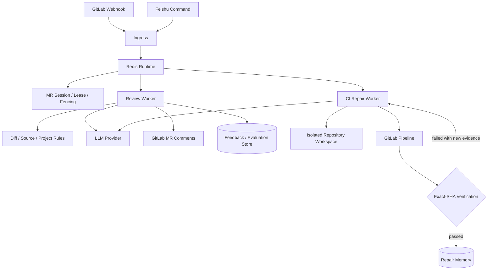

<div align="center">

# MR-Agent

面向 GitLab Merge Request 的智能代码审查与 CI 流水线自修复平台

[](https://www.python.org/)
[](LICENSE)
[](https://about.gitlab.com/)

</div>

MR-Agent is an open-source platform for AI-assisted GitLab merge request review and CI pipeline repair. It runs review and
repair workloads on a Redis-backed runtime, validates model output against repository and pipeline evidence, and publishes results
back to the merge request.

MR-Agent 接收 GitLab Webhook 或飞书指令，读取 MR Diff、项目规范、源码和 CI 日志，通过可恢复的任务运行时执行代码审查
与流水线修复。所有外部操作均受任务状态、幂等键和权限配置约束。

## 核心能力

| 模块 | 输入 | 处理阶段 | 输出 |
|---|---|---|---|
| MR 智能审查与代码治理 | MR Diff、源码上下文、项目规范、历史反馈 | 问题识别、证据补全、多角色复核、发布决策 | 行级建议、审查摘要、风险项、反馈记录 |
| CI 流水线自修复 | 失败 Pipeline、Job 日志、目标 SHA、仓库工作区 | 故障分诊、修复规划、受控改码、精确 SHA 验证 | 修复提交、验证结果、可检索修复经验 |

## 架构



运行时以 MR 为并发边界。队列任务具备去重、互斥锁、租约续期、Fencing Token、失败重试和故障接管能力；评论、推送与
通知使用幂等身份，避免重复事件或过期 Worker 产生副作用。

## MR 智能审查与代码治理

- 多角色审查：依次完成问题识别、源码证据补全、建议复核和发布决策。
- 大 MR 拆分：按文件与 Token 预算分配任务，汇总阶段处理跨文件证据、重复建议和严重等级。
- 项目级 Dynamic Skill：按仓库加载规范、风险模式和审查样例；候选 Skill 通过离线回放和 Draft MR Review 验证后生效。
- 反馈与评测：记录建议的采纳、拒绝和修订结果，为回放评测及 Prompt/Skill 演进提供数据。
- 分布式执行：Redis 队列支持水平扩展，MR 会话状态用于协调自动任务和人工指令。

主要代码：`pr_agent/suggestions/`、`pr_agent/feedback/`、`pr_agent/eval/`、`pr_agent/distributed/`。

## CI 流水线自修复

- 混合执行图：Planner 生成版本化计划，ReAct Executor 调用受控工具，Verifier 负责终态判断。
- 状态化工具治理：Pydantic Schema 校验工具参数；状态机限制文件访问、代码修改、提交和任务结束条件。
- 证据上下文：分层保存任务身份、控制状态、日志和历史摘要，并按 Token 预算压缩长日志及多轮工具结果。
- Pipeline 验证：修复提交绑定目标 commit SHA，只接受该 SHA 对应的 Pipeline 结果。
- Repair Memory：仅记录通过 Pipeline 验证的修复动作，支持规则、BM25 和语义检索，并保留召回及结算审计信息。
- 失败保护：检测无收益修改、分支漂移、证据不足、重复失败和验证异常；必要时回滚本轮修改并结束自动执行。

主要代码：`pr_agent/triage/`、`ut_agent/`、`ut_agent/repair_memory/`。

## 快速开始

运行环境要求 Python 3.12 或更高版本。

```bash
git clone https://github.com/ZJunCher/mr-agent.git
cd mr-agent
python3.12 -m venv .venv
source .venv/bin/activate
pip install -r requirements.txt
pip install -r requirements-dev.txt
cp .env.example .env
```

通过环境变量提供 GitLab 和模型服务凭据：

```bash
export GITLAB__URL="https://gitlab.example.com"
export GITLAB__PERSONAL_ACCESS_TOKEN="your_gitlab_token"
export OPENAI__KEY="your_model_api_key"
```

本地执行一次 MR 审查：

```bash
python -m pr_agent.cli \
  --pr_url https://gitlab.example.com/example-group/example-project/-/merge_requests/42 \
  review
```

可用命令包括 `review`、`describe`、`improve`、`ask`、`triage` 和 `ut`。运行
`python -m pr_agent.cli --help` 查看完整参数。

## 配置

| 变量 | 用途 | 要求 |
|---|---|---|
| `GITLAB__URL` | GitLab 实例地址 | GitLab 部署必需 |
| `GITLAB__PERSONAL_ACCESS_TOKEN` | GitLab API 凭据 | GitLab 部署必需 |
| `GITLAB__SHARED_SECRET` | Webhook 请求校验 | 建议配置 |
| `OPENAI__KEY` | 默认模型服务凭据 | 至少配置一个模型提供方 |
| `OPENAI__API_BASE` | OpenAI 兼容接口地址 | 可选 |
| `PR_AGENT_EXECUTION_MODE` | `inline` 或 `queue` | 默认 `inline` |
| `PR_AGENT_REDIS_URL` | 队列、会话与 Checkpoint | `queue` 模式必需 |
| `FEISHU__APP_ID` / `FEISHU__APP_SECRET` | 飞书通知和交互卡片 | 可选 |
| `UT_AGENT_API_KEY` / `UT_AGENT_API_BASE` | CI Repair Agent 模型配置 | 可选 |
| `MR_AGENT_HOME` | Compose 数据与秘密文件目录 | 默认 `./runtime` |
| `MR_AGENT_ENV_FILE` | Compose 环境文件 | 默认 `.env` |

默认配置位于 `pr_agent/settings/configuration.toml`。仓库级覆盖项写入 `.pr_agent.toml`；凭据应由环境变量或秘密管理服务注入。

## Docker 部署

```bash
docker compose --profile model-init run --rm bge-m3-model-init
docker compose up -d \
  pr-agent-redis \
  bge-m3-service \
  pr-agent-web \
  pr-agent-agent \
  pr-agent-memory
```

Redis ACL 和密码文件存放在 `${MR_AGENT_HOME:-./runtime}/redis/`。飞书组件为可选服务，配置应用凭据后启动
`pr-agent-feishu`。

## 测试

运行单元测试：

```bash
PYTHONPATH=. ./.venv/bin/pytest tests/unittest -q
```

运行审查 Runtime 与 CI 修复的重点测试：

```bash
PYTHONPATH=. ./.venv/bin/pytest \
  tests/unittest/test_distributed_executor.py \
  tests/unittest/test_pr_reviewer_map_reduce.py \
  tests/unittest/test_native_repair_hybrid_graph.py \
  tests/unittest/test_repair_memory_retrieval.py -q
```

`tests/e2e_tests/` 依赖真实 Git provider、Redis 和模型服务。发布前可运行隐私检查：

```bash
PYTHONPATH=. python scripts/audit_public_release.py --root .
```

审计输出仅包含规则名称和文件位置，不回显疑似凭据。

## 项目结构

```text
pr_agent/
├── agent/               # 命令编排
├── distributed/         # Redis Runtime、租约、幂等与恢复
├── feedback/            # 建议反馈与统计
├── feishu/              # 飞书事件、卡片与通知
├── suggestions/         # 审查建议、复核与 Skill 演进
└── triage/              # CI 失败分类与修复状态

ut_agent/
├── prompt/              # 诊断、规划、改码与验证 Prompt
├── repair_memory/       # 修复经验、检索与审计
├── tools/               # 受控仓库及 Pipeline 工具
└── agent.py             # CI Repair Agent 执行图
```

## 安全

- 使用最小权限的 GitLab 机器人账号，并通过受保护分支策略限制推送范围。
- 模型提供方会接收完成任务所需的 MR Diff、源码片段或 CI 日志；部署前应完成数据合规评估。
- Repair Memory 的检索结果属于不可信提示，必须重新通过当前代码和目标 SHA Pipeline 验证。
- 凭据不得写入仓库、镜像或日志。`.env`、本地工作区、数据库和日志文件已加入忽略规则。
- 自动修复遇到证据不足、外部基础设施故障或验证异常时进入显式终态，并保留人工接管入口。

安全问题请通过 [GitHub Security Advisories](SECURITY.md) 私密报告，不要在公开 Issue 中提交密钥或漏洞细节。

## 效果数据

以下数据来自历史部署统计，不包含原始 MR、Pipeline、日志或评测数据集。

| 指标 | 结果 |
|---|---:|
| 已处理 MR | 4,000+ |
| 稳定并发处理规模 | 100+ MR |
| 误报与低价值建议降幅 | 约 73% |
| 代码建议采纳率 | 28% |
| 已处理失败流水线 | 600+ |
| CI 修复成功率 | 86% |
| 所测项目平均单元测试覆盖率 | 17% → 82% |

统计结果受仓库类型、失败类别、模型配置和验证规则影响。

## 开源说明

MR-Agent 基于 [PR-Agent](https://github.com/qodo-ai/pr-agent) 开发，保留公开上游历史和原许可证。本仓库维护 GitLab MR
分布式审查、飞书协作、CI 修复、Repair Memory 与项目级 Skill 演进等扩展，具体范围见 [NOTICE.md](NOTICE.md)。

MR-Agent 是独立维护的开源分支，不是 Qodo 官方产品。贡献前请阅读 [CONTRIBUTING.md](CONTRIBUTING.md)。

## License

本项目按 [GNU Affero General Public License v3.0](LICENSE) 发布。
