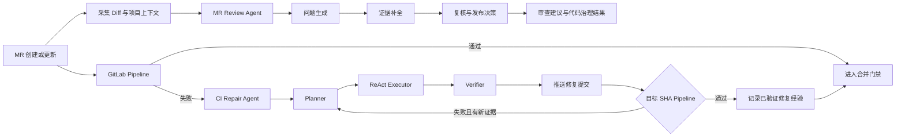

<div align="center">

# MR-Agent

面向 GitLab Merge Request 全生命周期的智能代码治理与 CI 自愈平台

[](https://www.python.org/)
[](LICENSE)
[](https://about.gitlab.com/)

</div>

MR-Agent connects code review and CI repair in one Merge Request workflow. The Review Agent checks changes, gathers evidence,
filters low-value suggestions, and publishes actionable feedback. When a pipeline fails, the CI Repair Agent diagnoses the
failure, edits code inside a constrained workspace, and accepts a repair only after the pipeline for the exact commit SHA passes.

MR-Agent 把两类原本割裂的工作放进同一条 MR 链路：代码进入仓库后先做审查与治理；流水线失败时，再基于当前 Diff、
源码、构建配置和 CI 证据进入修复闭环。项目由两个相互协作、边界清晰的 Agent 组成。

## 两个 Agent，一条 MR 链路

| Agent | 负责什么 | 主要机制 |
|---|---|---|
| MR Review Agent | 风险识别、代码建议、证据补全、建议复核、协作通知 | 多角色审查、分布式 Runtime、反馈闭环、项目级 Dynamic Skill |
| CI Repair Agent | 失败归因、修复计划、受控改码、流水线验证、经验沉淀 | Planner + ReAct Executor + Verifier、工具门禁、Redis Checkpoint、Repair Memory |



## MR Review Agent

Review Agent 不是把一次模型调用直接贴到 MR。它把建议生成、证据核对、价值判断和发布拆开处理，并把每一步放进可恢复的
任务运行时。

- 分布式 Agent Runtime：Redis 队列负责异步执行，配合任务去重、MR 互斥锁、租约续期、失败重试与故障接管。
  Fencing Token、幂等键和执行状态隔离用于阻止旧 Worker 重复评论或覆盖新结果。
- 多角色审查链路：问题生成后继续补充源码与项目证据，再经过复核和发布决策。低置信度、缺少定位依据或价值有限的建议
  不会直接进入 MR。
- 项目级 Dynamic Skill：项目规范、审查偏好、风险模式和典型案例按仓库加载。误报、漏报和坏建议会转成可回放案例，
  候选 Skill 经过离线评测和 Draft MR Review 后才生效。
- 大 MR 处理：按文件和 Token 预算拆分审查任务，保留跨文件上下文，并在汇总阶段去重、合并证据和统一严重等级。
- 反馈闭环：记录建议是否被采纳、拒绝或修订，用于后续评测；线上反馈不会绕过验证门槛直接修改 Prompt。

相关代码主要位于 `pr_agent/suggestions/`、`pr_agent/feedback/`、`pr_agent/eval/` 和
`pr_agent/distributed/`。

## CI Repair Agent

CI Repair Agent 处理的是“修复是否真的生效”，不是只生成一段看起来合理的补丁。

- 混合执行图：Planner 生成版本化修复计划；ReAct Executor 根据当前证据选择工具；独立 Verifier 判断修复是否满足
  代码、测试与流水线门槛。
- 状态化工具治理：工具参数使用 Pydantic Schema 校验。任务状态决定哪些工具此刻可调用、允许读取哪些证据、可以修改
  哪些文件，以及何时能够提交和结束。
- 证据感知上下文：任务身份、控制状态、原始日志和历史摘要分层管理。长日志、跨包依赖与多轮工具结果按 Token 预算
  去重压缩；Redis Checkpoint 支持等待流水线期间释放 Worker，并在回调或超时后恢复。
- SHA 级 Pipeline 闭环：每次推送都会持久化目标 commit SHA。Verifier 只接收与该 SHA 对应的 Pipeline，旧流水线的成功
  结果不能污染当前修复任务。
- 分层 Repair Memory：只有被目标 Pipeline 验证通过的动作才能成为修复经验。检索结合规则、BM25 与语义召回，并保存
  候选、阈值、选择原因和最终结算结果，方便回看一次经验是否真正帮助了修复。
- 修复安全：无收益修改、分支漂移、证据不足、重复失败和验证异常都有显式终态；必要时回滚本轮改动，把任务交还给人。

相关代码主要位于 `pr_agent/triage/`、`ut_agent/` 和 `ut_agent/repair_memory/`。

## 工程实践数据

下面的数据来自项目在内部研发环境中的历史运行记录，用于说明处理规模和工程效果。私有 MR、流水线、日志和评测数据集
不在本仓库中，因此这些数字不能仅靠公开代码直接复现。

| 指标 | 历史结果 |
|---|---:|
| 已处理 MR | 4,000+ |
| 稳定并发处理规模 | 100+ MR |
| 误报与低价值建议降幅 | 约 73% |
| 代码建议采纳率 | 28% |
| 已处理失败流水线 | 600+ |
| CI 修复成功率 | 86% |
| 所测项目平均单元测试覆盖率 | 17% → 82% |

统计口径会受到仓库类型、失败类别、模型配置和验证规则影响。公开版本没有预置这些结果，也不会上传任何原始业务数据。

## 架构

```text
GitLab Webhook / Feishu Event
            │
            ▼
      Ingress + 去重
            │
            ▼
       Redis Broker
       ├── MR Session / Lease / Fencing
       ├── Review Agent Worker
       ├── CI Repair Agent Worker
       ├── Repair Memory Worker
       └── Prompt & Skill Evolution Worker
            │
            ├── GitLab API
            ├── LLM Provider
            ├── Repository Workspace
            ├── CI Pipeline
            └── Feishu Notification
```

核心设计约束：

1. MR 是并发与互斥边界。同一 MR 的自动审查、人工命令和修复任务共享会话状态，不同 MR 可以并行执行。
2. 当前源码和当前 CI 证据优先于历史经验。Repair Memory 只提供提示，不能覆盖当前仓库事实。
3. 生成结果不等于成功。代码建议要经过复核，修复提交要经过精确 SHA 的 Pipeline 验证。
4. 外部副作用需要幂等身份。评论、推送、通知和任务接管都能识别重复事件与过期 Worker。

## 快速开始

### 1. 准备环境

要求 Python 3.12 或更高版本。

```bash
git clone https://github.com/ZJunCher/mr-agent.git
cd mr-agent
python3.12 -m venv .venv
source .venv/bin/activate
pip install -r requirements.txt
pip install -r requirements-dev.txt
```

### 2. 配置凭据

不要把凭据写入 Git。下面使用的地址和密钥都是不可用示例：

```bash
export GITLAB__URL="https://gitlab.example.com"
export GITLAB__PERSONAL_ACCESS_TOKEN="your_gitlab_token"
export OPENAI__KEY="your_model_api_key"
```

如果模型服务使用兼容接口，可以另外设置 `OPENAI__API_BASE`。CI Repair Agent 也接受
`UT_AGENT_API_KEY` 和 `UT_AGENT_API_BASE`；它们未设置时会回退到通用 OpenAI 配置。

### 3. 从命令行运行审查

```bash
python -m pr_agent.cli \
  --pr_url https://gitlab.example.com/example-group/example-project/-/merge_requests/42 \
  review
```

常用命令包括 `review`、`describe`、`improve`、`ask`、`triage` 和 `ut`。完整参数以
`python -m pr_agent.cli --help` 为准。

### 4. 启动分布式服务

复制 `.env.example` 并通过安全的凭据管理方式填入变量。Redis ACL 与密码文件放在
`${MR_AGENT_HOME:-./runtime}/redis/`，不要提交到仓库。

```bash
cp .env.example .env
docker compose --profile model-init run --rm bge-m3-model-init
docker compose up -d pr-agent-redis bge-m3-service pr-agent-web pr-agent-agent pr-agent-memory
```

飞书通知是可选能力；配置应用凭据后再启动 `pr-agent-feishu`。

## 配置

| 变量 | 用途 | 是否必需 |
|---|---|---|
| `GITLAB__URL` | GitLab 实例地址 | GitLab 部署必需 |
| `GITLAB__PERSONAL_ACCESS_TOKEN` | GitLab API 访问 | GitLab 部署必需 |
| `GITLAB__SHARED_SECRET` | Webhook 请求校验 | Webhook 部署建议设置 |
| `OPENAI__KEY` | 默认模型服务凭据 | 至少配置一个模型提供方 |
| `OPENAI__API_BASE` | OpenAI 兼容服务地址 | 可选 |
| `PR_AGENT_EXECUTION_MODE` | `inline` 或 `queue` | 默认 `inline` |
| `PR_AGENT_REDIS_URL` | 分布式队列和 Checkpoint | `queue` 模式必需 |
| `FEISHU__APP_ID` / `FEISHU__APP_SECRET` | 飞书通知与交互卡片 | 可选 |
| `UT_AGENT_API_KEY` / `UT_AGENT_API_BASE` | CI Repair Agent 独立模型配置 | 可选 |
| `MR_AGENT_HOME` | Compose 持久化与秘密文件目录 | 默认 `./runtime` |
| `MR_AGENT_ENV_FILE` | Compose 读取的环境文件 | 默认 `.env` |

完整默认值见 `pr_agent/settings/configuration.toml`。仓库级行为通过 `.pr_agent.toml` 覆盖，敏感配置应放在环境变量或
秘密管理服务中。

## 测试

```bash
PYTHONPATH=. ./.venv/bin/pytest tests/unittest -q
```

针对两个 Agent 的常用测试入口：

```bash
PYTHONPATH=. ./.venv/bin/pytest \
  tests/unittest/test_distributed_executor.py \
  tests/unittest/test_pr_reviewer_map_reduce.py \
  tests/unittest/test_native_repair_hybrid_graph.py \
  tests/unittest/test_repair_memory_retrieval.py -q
```

`tests/e2e_tests/` 和部分集成测试需要真实 Git provider、Redis 或模型服务凭据，默认不会在无凭据环境中运行。

发布前可以运行仓库自带的隐私检查：

```bash
PYTHONPATH=. python scripts/audit_public_release.py --root .
```

检查只输出规则和文件位置，不回显疑似密钥内容。

## 目录

```text
pr_agent/
├── agent/               # 命令编排
├── distributed/         # Redis Runtime、租约、幂等与恢复
├── feedback/            # 建议反馈与统计
├── feishu/              # 飞书事件、卡片和通知
├── suggestions/         # 审查建议、复核与 Skill 演进
└── triage/              # CI 失败分类、修复状态与终态

ut_agent/
├── prompt/              # 诊断、计划、改码和验证 Prompt
├── repair_memory/       # 修复经验、检索与审计
├── tools/               # 受控仓库与流水线工具
└── agent.py             # CI Repair Agent 执行图
```

## 安全边界与限制

- Agent 会读取 MR Diff、相关源码和 CI 日志，并把必要上下文发送给配置的模型提供方。部署者需要自行评估数据合规要求。
- 自动修复应使用受限机器人账号、受保护分支策略和最小权限 Token。不要让 Agent 直接写入默认分支。
- 业务逻辑错误、外部基础设施故障和缺少可验证证据的问题可能无法自动修复。系统会停止并说明原因，不承诺修复所有失败。
- Repair Memory 只收录被流水线验证的动作；被召回的历史经验仍是不可信提示，需要重新通过当前代码和 CI 验证。
- 本仓库不提供托管服务，也不包含任何内部运行数据、凭据或私有评测集。

发现安全问题时，请按 [SECURITY.md](SECURITY.md) 提交私密报告，不要在公开 Issue 中披露密钥或可利用细节。

## 上游与许可证

MR-Agent 基于开源项目 [PR-Agent](https://github.com/qodo-ai/pr-agent) 扩展，保留其公开历史与 AGPL-3.0 许可证。
本仓库增加了面向 GitLab MR 的分布式审查、飞书协作、CI 修复、Repair Memory 和项目级 Skill 演进能力。

MR-Agent 是独立维护的社区分支，不是 Qodo 官方产品。详细来源和变更范围见 [NOTICE.md](NOTICE.md)。

代码按 [GNU Affero General Public License v3.0](LICENSE) 发布。
