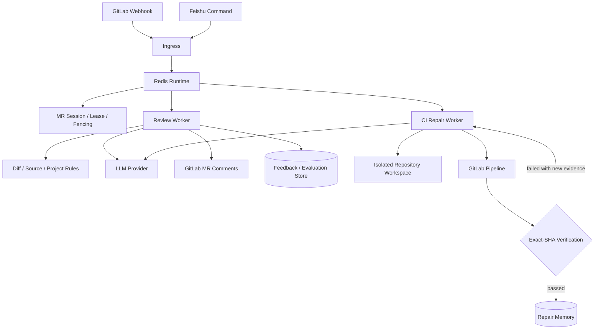
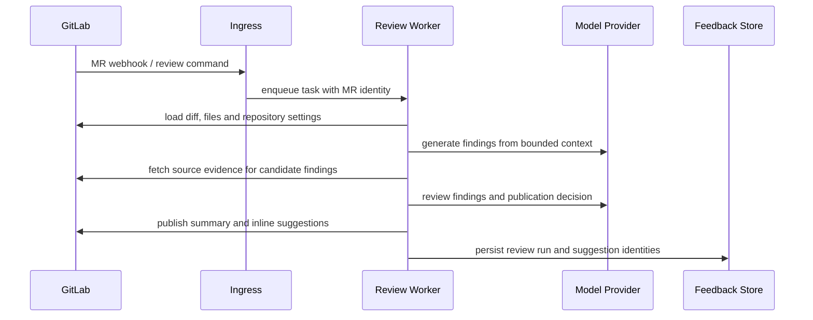
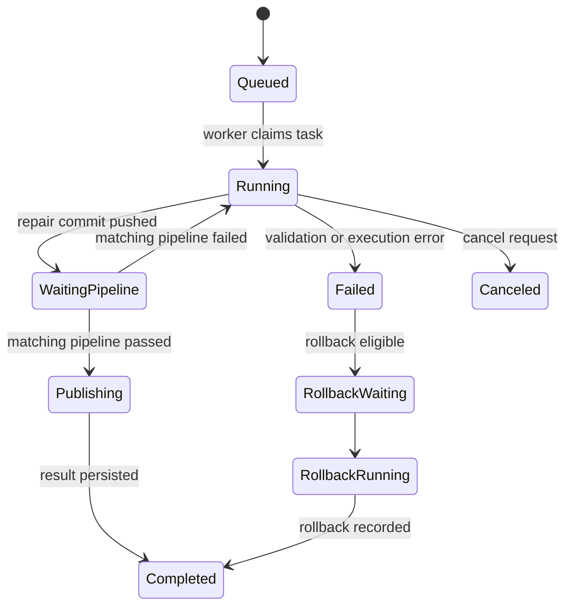
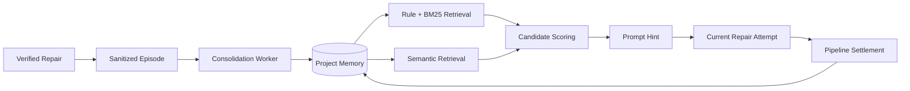

<div align="center">

# MR-Agent

面向 GitLab Merge Request 的智能代码审查与 CI 流水线自修复平台

[](https://www.python.org/)
[](LICENSE)
[](https://about.gitlab.com/)

</div>

MR-Agent is an open-source platform for AI-assisted GitLab merge request review and CI pipeline repair. It runs review and
repair workloads on a Redis-backed runtime, validates model output against repository and pipeline evidence, and publishes results
back to the merge request.

MR-Agent 接收 GitLab Webhook 或飞书指令，读取 MR Diff、项目规范、源码和 CI 日志，通过可恢复的任务运行时执行代码审查
与流水线修复。所有外部操作均受任务状态、幂等键和权限配置约束。

## 核心能力

| 模块 | 输入 | 处理阶段 | 输出 |
|---|---|---|---|
| MR 智能审查与代码治理 | MR Diff、源码上下文、项目规范、历史反馈 | 问题识别、证据补全、多角色复核、发布决策 | 行级建议、审查摘要、风险项、反馈记录 |
| CI 流水线自修复 | 失败 Pipeline、Job 日志、目标 SHA、仓库工作区 | 故障分诊、修复规划、受控改码、精确 SHA 验证 | 修复提交、验证结果、可检索修复经验 |

## 架构



运行时以 MR 为并发边界。队列任务具备去重、互斥锁、租约续期、Fencing Token、失败重试和故障接管能力；评论、推送与
通知使用幂等身份，避免重复事件或过期 Worker 产生副作用。

## 系统组件

| 组件 | 职责 | 主要状态或依赖 |
|---|---|---|
| Ingress | 接收 GitLab Webhook、命令和飞书事件，完成签名校验与任务入队 | GitLab Shared Secret、Redis Broker |
| Redis Broker | 保存任务、租约、幂等键、Pipeline 回调和服务心跳 | Redis ACL、持久化目录 |
| MR Session | 协调同一 MR 下的普通任务和修复任务，维护独占关系 | `project_id + MR iid`、Fencing Token |
| Review Worker | 执行审查、描述、建议和反馈相关命令 | GitLab API、LLM Provider、项目配置 |
| CI Repair Worker | 运行分诊与修复状态机，管理工作区和 Pipeline 等待 | 隔离工作区、GitLab Pipeline、Checkpoint |
| Feishu Worker | 消费通知任务，更新交互卡片和修复进度 | 飞书应用凭据、Redis Broker |
| Feedback / Evaluation Store | 保存建议反馈、回放记录和评测结果 | SQLite |
| Repair Memory Worker | 整理已验证修复记录，生成检索索引并执行保留策略 | SQLite、BGE-M3 Embedding Service |
| Prompt Evolution Worker | 聚合评测证据，生成并验证 Prompt 或 Skill 候选变更 | GitLab API、模型服务、评测存储 |

Ingress 不直接执行耗时任务。进入队列的请求会生成稳定的 `task_id` 和 `idempotency_key`，Worker 领取任务后再创建 Git
provider、模型客户端和工作区。这样可以独立扩展入口进程与执行进程，也便于在 Worker 退出后重新分配未完成任务。

## MR 智能审查与代码治理

- 多角色审查：依次完成问题识别、源码证据补全、建议复核和发布决策。
- 大 MR 拆分：按文件与 Token 预算分配任务，汇总阶段处理跨文件证据、重复建议和严重等级。
- 项目级 Dynamic Skill：按仓库加载规范、风险模式和审查样例；候选 Skill 通过离线回放和 Draft MR Review 验证后生效。
- 反馈与评测：记录建议的采纳、拒绝和修订结果，为回放评测及 Prompt/Skill 演进提供数据。
- 分布式执行：Redis 队列支持水平扩展，MR 会话状态用于协调自动任务和人工指令。

主要代码：`pr_agent/suggestions/`、`pr_agent/feedback/`、`pr_agent/eval/`、`pr_agent/distributed/`。

### 审查流程



审查任务先固定 MR 身份、目标 commit 和配置快照，再读取变更文件。候选问题必须带有文件位置和可核对的上下文；证据补全
阶段可以继续读取相关源码，但不能绕过文件过滤、Token 预算和项目权限。复核阶段统一严重等级，合并重复问题，并决定建议
进入行级评论、审查摘要或仅保留在评测记录中。

发布后的建议拥有稳定身份。重复 Webhook、任务重试或 Worker 接管不会再次创建同一条评论；用户反馈也能关联到生成该建议
的审查运行、Prompt 版本和项目级 Skill 版本。

### 大 MR 并行处理

大 MR 会根据文件、语言和 Token 预算拆成多个审查分片。每个分片独立生成候选问题，Reduce 阶段再处理跨文件关系和重复
建议。单个分片失败不会自动把不完整结果标记为完整审查，任务状态会保留失败原因和已经完成的分片。

| 阶段 | 处理内容 |
|---|---|
| 预处理 | 应用 ignore 规则，计算文件与补丁规模，保留必要的仓库元数据 |
| Map | 为每组文件构造受限上下文，并行生成带位置的候选问题 |
| Evidence | 按候选问题补充定义、调用点、配置或测试等源码证据 |
| Reduce | 去重、合并跨文件问题，统一严重等级与输出顺序 |
| Publish | 使用建议身份和幂等键发布评论及摘要 |

### 反馈、评测与 Dynamic Skill

建议反馈分为采纳、拒绝和修订，并保存生成上下文的版本标识。离线评测从历史审查运行中选择可回放样本，对新 Prompt 或
Skill 候选执行同一套输入，比较问题定位、证据质量、误报和建议采纳情况。

项目级 Dynamic Skill 按仓库和语言作用域加载。候选版本要经过格式校验、离线回放和 Draft MR Review；未通过门禁的版本
不会替换当前生效版本。线上反馈用于生成候选和评测数据，不直接改写生产 Prompt。

## CI 流水线自修复

- 混合执行图：Planner 生成版本化计划，ReAct Executor 调用受控工具，Verifier 负责终态判断。
- 状态化工具治理：Pydantic Schema 校验工具参数；状态机限制文件访问、代码修改、提交和任务结束条件。
- 证据上下文：分层保存任务身份、控制状态、日志和历史摘要，并按 Token 预算压缩长日志及多轮工具结果。
- Pipeline 验证：修复提交绑定目标 commit SHA，只接受该 SHA 对应的 Pipeline 结果。
- Repair Memory：仅记录通过 Pipeline 验证的修复动作，支持规则、BM25 和语义检索，并保留召回及结算审计信息。
- 失败保护：检测无收益修改、分支漂移、证据不足、重复失败和验证异常；必要时回滚本轮修改并结束自动执行。

主要代码：`pr_agent/triage/`、`ut_agent/`、`ut_agent/repair_memory/`。

### 修复状态流转



修复任务保存源 Pipeline、当前 Pipeline、目标 SHA、尝试次数、终态原因和验证证据。进入 `waiting_pipeline` 后，执行图通过
Redis Checkpoint 释放 Worker；GitLab 回调到达或轮询命中后，任务从原状态恢复。回调必须同时匹配项目、Pipeline 和 SHA。

终态不只区分成功与失败。系统会记录被阻塞、模型不可用、部分完成、取消、验证异常和回滚结果，便于通知层与 Dashboard
使用相同口径展示任务结果。

### Planner、ReAct Executor 与 Verifier

| 角色 | 输入 | 约束 | 产物 |
|---|---|---|---|
| Planner | 失败分类、日志摘要、Diff、仓库结构、历史提示 | 计划带版本号；每一步必须对应允许的工具 | 修复计划和验证条件 |
| ReAct Executor | 当前计划、工具结果、剩余预算 | 工具参数经 Schema 校验；文件范围与调用顺序由状态控制 | 工作区修改、测试结果、提交候选 |
| Verifier | 变更摘要、本地检查、目标 SHA Pipeline | 不接受旧 Pipeline 或仅凭模型判断成功 | 继续修复、等待、成功或失败终态 |

工具层把读取、搜索、编辑、测试、提交和 Pipeline 查询分开授权。执行器每轮只能看到当前状态允许的工具；工具输出会进入
证据上下文，同时受长度限制和去重规则约束。计划发生变化时会生成新版本，旧步骤不会在新状态下继续执行。

### Pipeline 验证与回滚

修复提交推送后，任务记录 commit SHA，并等待该 SHA 对应的 Pipeline。Pipeline 成功后才能写入成功终态和 Repair Memory；
失败结果会作为新证据返回 Planner。若没有新的可执行路径，任务停止重试并生成有界的失败说明。

回滚使用修复提交清单核对受影响文件和提交身份。分支已前进、提交归属不明或当前 Worker 丢失租约时，自动回滚不会继续。
符合条件的回滚由独立任务执行，回滚提交 SHA 和结果会追加到原修复记录，不覆盖原始验证证据。

## Runtime 可靠性

| 机制 | 行为 |
|---|---|
| 任务幂等 | 相同事件和命令复用幂等键，重复投递不产生第二份外部副作用 |
| MR 会话 | 普通审查任务可并行；分诊和修复任务取得同一 MR 的独占权 |
| 租约续期 | Worker 周期性续租 MR；续租失败后停止写入并释放本地会话 |
| Fencing Token | 每次重新认领生成更高代际，GitLab 评论、推送和状态写入拒绝过期代际 |
| Checkpoint | Pipeline 等待期间持久化执行状态，释放计算资源并支持跨进程恢复 |
| 回调认领 | Pipeline 恢复事件区分已认领、重复、过期和租约丢失 |
| 生命周期记录 | 排队、领取、等待、恢复、发布和终态事件写入可查询记录 |
| 服务心跳 | Web、Agent、Feishu 等服务上报存活状态，健康检查据此判断可用性 |

同一 MR 内，修复任务会等待正在执行的普通任务结束，再取得独占权。修复在等待 Pipeline 时仍保留独占关系，防止审查命令
基于中间态代码运行；恢复事件必须由持有当前租约的 Worker 处理。不同 MR 使用独立会话，可以分配给不同 Worker 并行执行。

## Repair Memory

Repair Memory 保存经过验证的修复经验，不保存完整源码或原始日志。一次记录包含问题模式、适用条件、修复动作、验证身份和
结果摘要；写入失败采用 best-effort 处理，不改变当前修复任务的终态。



检索先按项目、语言、工具链和失败分类过滤，再合并规则匹配、BM25 与语义候选。候选记录保存各路得分、阈值、选择结果和
拒绝原因。送入 Prompt 的内容只包含 memory ID、匹配原因、问题模式、修复动作与验证说明，并标记为不可信提示。

下一条目标 SHA Pipeline 会结算本次召回是否带来即时成功。成功和失败都会更新命中次数及置信度；低置信度记录进入复核
状态。后台 Worker 负责 Episode 整理、可选的跨项目晋升、Embedding 更新和过期数据清理，处理失败的 Episode 会回到可重试
状态，并通过租约避免多个 Worker 重复整理。

## 快速开始

运行环境要求 Python 3.12 或更高版本。

```bash
git clone https://github.com/ZJunCher/mr-agent.git
cd mr-agent
python3.12 -m venv .venv
source .venv/bin/activate
pip install -r requirements.txt
pip install -r requirements-dev.txt
cp .env.example .env
```

通过环境变量提供 GitLab 和模型服务凭据：

```bash
export GITLAB__URL="https://gitlab.example.com"
export GITLAB__PERSONAL_ACCESS_TOKEN="your_gitlab_token"
export OPENAI__KEY="your_model_api_key"
```

本地执行一次 MR 审查：

```bash
python -m pr_agent.cli \
  --pr_url https://gitlab.example.com/example-group/example-project/-/merge_requests/42 \
  review
```

可用命令包括 `review`、`describe`、`improve`、`ask`、`triage` 和 `ut`。运行
`python -m pr_agent.cli --help` 查看完整参数。

## 配置

| 变量 | 用途 | 要求 |
|---|---|---|
| `GITLAB__URL` | GitLab 实例地址 | GitLab 部署必需 |
| `GITLAB__PERSONAL_ACCESS_TOKEN` | GitLab API 凭据 | GitLab 部署必需 |
| `GITLAB__SHARED_SECRET` | Webhook 请求校验 | 建议配置 |
| `OPENAI__KEY` | 默认模型服务凭据 | 至少配置一个模型提供方 |
| `OPENAI__API_BASE` | OpenAI 兼容接口地址 | 可选 |
| `PR_AGENT_EXECUTION_MODE` | `inline` 或 `queue` | 默认 `inline` |
| `PR_AGENT_REDIS_URL` | 队列、会话与 Checkpoint | `queue` 模式必需 |
| `FEISHU__APP_ID` / `FEISHU__APP_SECRET` | 飞书通知和交互卡片 | 可选 |
| `UT_AGENT_API_KEY` / `UT_AGENT_API_BASE` | CI Repair Agent 模型配置 | 可选 |
| `MR_AGENT_HOME` | Compose 数据与秘密文件目录 | 默认 `./runtime` |
| `MR_AGENT_ENV_FILE` | Compose 环境文件 | 默认 `.env` |

默认配置位于 `pr_agent/settings/configuration.toml`。仓库级覆盖项写入 `.pr_agent.toml`；凭据应由环境变量或秘密管理服务注入。

## 部署拓扑

### Compose 服务

| 服务 | 进程职责 | 启动依赖 |
|---|---|---|
| `pr-agent-redis` | 任务队列、MR 租约、Checkpoint、回调缓存和服务心跳 | Redis 配置、ACL 和密码文件 |
| `bge-m3-service` | 为 Repair Memory 提供本地向量化接口 | 预下载的 BGE-M3 模型目录 |
| `pr-agent-web` | 提供 GitLab Webhook、健康检查和 Dashboard HTTP 入口 | 健康的 Redis |
| `pr-agent-agent` | 消费审查与修复任务，维护工作区并等待 Pipeline | 健康的 Redis、GitLab 与模型凭据 |
| `pr-agent-feishu` | 消费飞书事件和通知任务 | 健康的 Redis、飞书应用凭据 |
| `pr-agent-memory` | 整理 Repair Episode、更新索引并清理过期数据 | Redis、SQLite 数据目录、Embedding Service |
| `pr-agent-prompt-evolution` | 定时执行 Prompt 与项目 Skill 候选生成及评测 | Redis、GitLab 与模型凭据 |

所有服务位于 `pr-agent-internal` Bridge 网络。只有 `pr-agent-web` 默认映射宿主机 `8080` 端口；Redis 和模型服务不需要
直接暴露到外网。

### 启动顺序

首次部署先准备 Redis 密码与 ACL，再下载 Embedding 模型。随后启动核心服务：

```bash
docker compose --profile model-init run --rm bge-m3-model-init
docker compose up -d \
  pr-agent-redis \
  bge-m3-service \
  pr-agent-web \
  pr-agent-agent \
  pr-agent-memory
```

确认核心服务健康后，再按需启动协作和演进 Worker：

```bash
docker compose up -d pr-agent-feishu pr-agent-prompt-evolution
docker compose ps
```

`pr-agent-web` 的就绪检查访问容器内 `/health/ready`；Agent 与 Feishu Worker 使用队列心跳健康检查；Prompt Evolution Worker
提供独立的 `--healthcheck` 命令。BGE-M3 首次加载时间较长，Compose 为它设置了单独的启动宽限期。

### 持久化与停机

Redis 数据、SQLite 数据库、Embedding 模型和修复工作区位于 `${MR_AGENT_HOME:-./runtime}`。其中 Redis ACL 与密码文件存放
在 `runtime/redis/`，模型位于 `runtime/data/models/`，修复工作区位于 `runtime/ut_workspace/`。备份前应停止写入 Worker，
并同时保存 Redis 与 SQLite 数据，避免任务状态和评测记录处于不同时间点。

```bash
docker compose stop pr-agent-agent pr-agent-memory pr-agent-prompt-evolution
docker compose down
```

`docker compose down` 不会删除绑定到宿主机的持久化目录。升级镜像前先保留 `.env`、Redis 配置和数据目录备份；不要使用
`docker compose down -v` 清理仍需保留的状态。

## 可观测性

任务日志包含 `task_id`、MR 身份、Worker 和状态变化，可用于串联 Webhook、队列执行、Pipeline 等待与通知。日志不应输出
完整 Token、认证 Header 或模型请求中的私有源码。常用检查命令：

```bash
docker compose ps
docker compose logs -f pr-agent-web
docker compose logs -f pr-agent-agent
docker compose restart pr-agent-agent
```

排查单个任务时先确定 `task_id`，再核对其租约、Fencing Token、当前状态、目标 SHA 和最后一条生命周期事件。Pipeline 修复
还需要同时核对源 Pipeline 与验证 Pipeline，不能只看分支上最近一次成功记录。

## 常见问题

| 现象 | 检查项 |
|---|---|
| Webhook 返回成功但没有任务 | 检查事件类型、Shared Secret、项目过滤规则和幂等键是否命中已有任务 |
| 任务长时间停留在 queued | 检查 Redis 连接、Agent Worker 心跳、队列积压和租约领取记录 |
| 模型调用持续失败 | 检查 Provider Key、Base URL、模型名、超时和模型故障转移状态 |
| 修复停留在 waiting_pipeline | 检查 GitLab 回调、目标 commit SHA、Pipeline ID，以及回调是否被判定为重复或过期 |
| 能读取 MR 但不能评论或推送 | 检查机器人 Token Scope、项目成员角色、受保护分支和推送规则 |
| Worker 重启后任务没有恢复 | 检查 Redis 持久化、Checkpoint、租约过期时间和新 Worker 的接管日志 |
| Repair Memory 没有召回结果 | 检查项目 Allowlist、失败分类、最小得分、Embedding 服务和索引更新时间 |

## 测试策略

| 层级 | 目录或入口 | 覆盖范围 |
|---|---|---|
| 单元测试 | `tests/unittest/` | 状态机、Broker、Provider、工具约束、检索和格式化逻辑 |
| 健康测试 | `tests/health_test/` | `describe`、`review`、`improve` 的基础调用路径 |
| 端到端测试 | `tests/e2e_tests/` | Git provider、Webhook 和真实外部依赖 |
| 发布审计 | `scripts/audit_public_release.py` | 私密路径、凭据模式、内部端点和自定义提交历史 |

运行单元测试：

```bash
PYTHONPATH=. ./.venv/bin/pytest tests/unittest -q
```

运行审查 Runtime 与 CI 修复的重点测试：

```bash
PYTHONPATH=. ./.venv/bin/pytest \
  tests/unittest/test_distributed_executor.py \
  tests/unittest/test_pr_reviewer_map_reduce.py \
  tests/unittest/test_native_repair_hybrid_graph.py \
  tests/unittest/test_repair_memory_retrieval.py -q
```

`tests/e2e_tests/` 依赖真实 Git provider、Redis 和模型服务。发布前可运行隐私检查：

```bash
PYTHONPATH=. python scripts/audit_public_release.py --root .
```

审计输出仅包含规则名称和文件位置，不回显疑似凭据。

## 项目结构

```text
pr_agent/
├── agent/               # 命令编排
├── distributed/         # Redis Runtime、租约、幂等与恢复
├── feedback/            # 建议反馈与统计
├── feishu/              # 飞书事件、卡片与通知
├── suggestions/         # 审查建议、复核与 Skill 演进
└── triage/              # CI 失败分类与修复状态

ut_agent/
├── prompt/              # 诊断、规划、改码与验证 Prompt
├── repair_memory/       # 修复经验、检索与审计
├── tools/               # 受控仓库及 Pipeline 工具
└── agent.py             # CI Repair Agent 执行图
```

## 安全

- 使用最小权限的 GitLab 机器人账号，并通过受保护分支策略限制推送范围。
- 模型提供方会接收完成任务所需的 MR Diff、源码片段或 CI 日志；部署前应完成数据合规评估。
- Repair Memory 的检索结果属于不可信提示，必须重新通过当前代码和目标 SHA Pipeline 验证。
- 凭据不得写入仓库、镜像或日志。`.env`、本地工作区、数据库和日志文件已加入忽略规则。
- 自动修复遇到证据不足、外部基础设施故障或验证异常时进入显式终态，并保留人工接管入口。

安全问题请通过 [GitHub Security Advisories](SECURITY.md) 私密报告，不要在公开 Issue 中提交密钥或漏洞细节。

## 效果数据

以下数据来自历史部署统计，不包含原始 MR、Pipeline、日志或评测数据集。

| 指标 | 结果 |
|---|---:|
| 已处理 MR | 4,000+ |
| 稳定并发处理规模 | 100+ MR |
| 误报与低价值建议降幅 | 约 73% |
| 代码建议采纳率 | 28% |
| 已处理失败流水线 | 600+ |
| CI 修复成功率 | 86% |
| 所测项目平均单元测试覆盖率 | 17% → 82% |

统计结果受仓库类型、失败类别、模型配置和验证规则影响。

## 开源说明

MR-Agent 基于 [PR-Agent](https://github.com/qodo-ai/pr-agent) 开发，保留公开上游历史和原许可证。本仓库维护 GitLab MR
分布式审查、飞书协作、CI 修复、Repair Memory 与项目级 Skill 演进等扩展，具体范围见 [NOTICE.md](NOTICE.md)。

MR-Agent 是独立维护的开源分支，不是 Qodo 官方产品。贡献前请阅读 [CONTRIBUTING.md](CONTRIBUTING.md)。

## License

本项目按 [GNU Affero General Public License v3.0](LICENSE) 发布。
