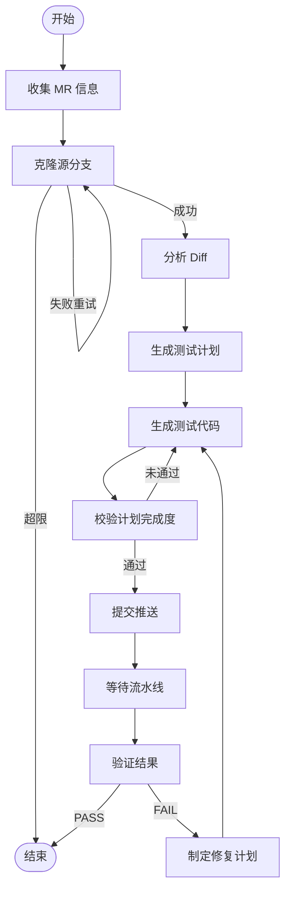

# UT Agent — 自动化单元测试生成 Agent

## 项目简介

`ut_agent` 是一个基于 **LangGraph** 状态机的自动化单元测试生成系统。它监听 GitLab Merge Request，自动完成从代码变更分析到测试生成、CI 验证、失败修复的完整闭环，最终将通过 CI 的测试代码提交到 MR 源分支。

## 设计目标

- **全自动闭环**：无需人工干预，从 MR 触发到 CI 通过一气呵成
- **高覆盖率**：目标增量行覆盖率 ≥ 80%，P0 用例 100% 覆盖
- **自动修复**：CI 失败后自动诊断、生成修复计划并重试（最多 5 轮）
- **Token 高效**：分批分析、分片计划、日志智能裁剪，避免 token 爆炸

## 架构概览



## 目录结构

```
ut_agent/
├── __init__.py            # 导出 UTAgent 类
├── agent.py               # 核心状态机（节点函数、路由逻辑、图构建）
├── state.py               # UTAgentState 类型定义
├── config.py              # 从 settings.toml 加载配置
├── llm.py                 # LLM 调用封装（支持自动续写）
├── settings.toml          # 模型/Agent 配置
├── prompt/                # Prompt 模板
│   ├── analyze_diff_system.md
│   ├── analyze_diff_user.md
│   ├── generate_test_plan_system.md
│   ├── generate_test_plan_user.md
│   ├── generate_patch_system.md
│   ├── generate_patch_user.md
│   ├── generate_patch_cpp.md
│   ├── generate_patch_python.md
│   ├── validate_plan_system.md
│   ├── plan_fix_system.md      # 修复计划 system prompt（含覆盖率不足特殊处理）
│   └── plan_fix_user.md        # 修复计划 user prompt
├── tools/                 # 工具层
│   ├── context.py         # ToolContext（git_provider/output_dir）
│   ├── clone_branch.py    # 浅克隆 MR 源分支
│   ├── commit_push.py     # git add/commit/push
│   ├── fetch_pipeline.py  # 轮询流水线状态、提取日志、记录覆盖率 job id
│   ├── fetch_coverage_report.py # 拉取并解析 changed_lines.html 未覆盖行报告
│   ├── fetch_dependency.py# 获取依赖文件（头文件等）
│   ├── parse_diff.py      # 解析 unified diff
│   ├── save_source.py     # 变更文件落盘
│   └── tool_registry.py   # LangGraph @tool 注册
├── test/                  # 测试与诊断脚本
│   ├── test_parse_diff.py
│   └── diag_pipeline.py
└── workspace/             # 运行时工作空间（自动创建）
```

## 工作流节点详解

### 1. collect_mr_info — 收集 MR 信息

记录 MR 标题、作者、源/目标分支、diff 文件列表等元数据。

### 2. clone_repo — 克隆源分支

执行 `git clone --depth 1 --branch <source_branch>`，最多重试 3 次。

### 3. analyze_diff — 分析变更

- 过滤已删除文件，仅关注新增/修改的代码
- ≤ 5 文件单次 LLM 调用；> 5 文件按批次（每批 5 个）分析
- 输出结构化 JSON：可测试单元、分支路径、外部依赖、优先级
- 分析结果发布为 MR 评论

### 4. generate_test_plan — 生成测试计划

- 读取 diff 分析结果 + 项目上下文（CMakeLists.txt、package.xml 等）
- 调用 LLM 生成大型 JSON 测试计划（支持自动续写，最多 3 次，32k tokens/次）
- 自动修复截断 JSON，按 5 个 suite 分片落盘

### 5. generate_patch — 生成测试代码

- 调用 **Copilot CLI**（`copilot -p <prompt> --allow-all-tools`）生成代码
- 支持三种模式：
  - 首次生成（按分片执行）
  - 补充生成（处理 pending_cases）
  - 修复生成（按 fix_plan 修复 CI 问题）
- 安全网：检测 CMakeLists.txt 异常修改时自动回滚重试
- 通过文件 mtime 快照检测新增/修改的文件

### 6. validate_plan — 校验计划完成度

- 扫描生成文件，提取测试函数名（GTest `TEST_F`/`TEST`、pytest `def test_`）
- 与计划中的用例名比对，计算完成率
- 通过条件：全部完成，或达到 80% 且 P0 全覆盖
- 未通过时回到 generate_patch 补充（最多 3 轮）

### 7. upload_to_gitlab — 提交推送

执行 `git add / commit / push`，提取 commit SHA 用于后续流水线追踪。

### 8. check_pipeline — 等待流水线

- 初始等待 60s，之后每 30s 轮询一次，最长等待 20 分钟
- 递归展开父子 pipeline（bridges → downstream）
- 关注目标 job：`build_release_arm64`、`x86_64_ut_coverage_check`
- 智能日志提取：正则匹配错误行 ± 上下文 + 尾部总结，上限 500 行

### 9. verify_pipeline — 验证结果

结构化判定 PASS/FAIL，失败分类：

| 类型 | 含义 |
|------|------|
| `build_failure` | 编译失败 |
| `test_failure` | 测试用例失败 |
| `coverage_insufficient` | 覆盖率不达标 |
| `pipeline_timeout` | 流水线超时 |
| `unknown` | 未知错误 |

### 10. plan_fix — 制定修复计划

根据 failure_type 和错误日志，LLM 生成针对性修复指令 JSON，驱动下一轮 generate_patch。

## 迭代循环机制

### 计划完善循环（generate_patch ↔ validate_plan）

```
generate_patch → validate_plan → pending_cases 不为空 → generate_patch（补充）→ ...
```

最多 3 轮（`MAX_PATCH_ITERATIONS = 3`），或 80%+ 完成率且 P0 全覆盖即放行。

### CI 修复循环（verify → fix → patch → upload → check → verify）

```
verify_pipeline(FAIL) → plan_fix → generate_patch(修复模式) → upload → check → verify → ...
```

最多 5 轮（`MAX_FIX_ITERATIONS = 5`）。

## 配置说明

`settings.toml` 配置项：

```toml
[llm]
model = "anthropic/claude-sonnet-4-5-20250929"  # LLM 模型
api_key = ""                                     # 使用 UT_AGENT_API_KEY 或 OPENAI_KEY
base_url = ""                                    # 使用 UT_AGENT_API_BASE 或 OPENAI_API_BASE
temperature = 0.2                                # 生成温度

[agent]
test_mode = false  # true 时跳过 LLM，生成 dummy 文件测试推送链路
```

关键硬编码常量（`agent.py`）：

| 常量 | 值 | 说明 |
|------|----|------|
| `MAX_CLONE_ATTEMPTS` | 3 | 克隆最大重试次数 |
| `MAX_PATCH_ITERATIONS` | 3 | Patch 生成最大迭代数 |
| `MAX_FIX_ITERATIONS` | 5 | CI 修复最大迭代数 |
| `BATCH_SIZE` | 5 | Diff 分析分批大小 |
| `MIN_COVERAGE_THRESHOLD` | 80% | 计划完成度最低阈值 |
| `COPILOT_TIMEOUT` | 600s | Copilot CLI 超时时间 |

## 运行时 Workspace

每次运行在 `ut_agent/workspace/` 下生成结构化输出：

```
workspace/
├── logs/ut_agent.log
└── mr_{id}/
    ├── repo/                    # 克隆的仓库
    ├── analysis/                # Diff 分析结果
    ├── changed_files/           # 变更文件全量源码
    ├── deps/                    # 依赖文件（头文件等）
    ├── test_plan.json           # 测试计划
    ├── plan_parts/              # 计划分片
    ├── generated_patches.json   # 生成的 patch 文件清单
    ├── validation_iter_N.json   # 各轮校验结果
    ├── pipeline_feedback.json   # 流水线反馈
    └── fix_plan_iterN.json      # 修复计划
```

## 自学习机制（Repair Memory）

UT-Agent 从被精确 SHA Pipeline 验证成功的修复中学习。只有 `final_pipeline_status == "success"` 且
`action.status == "verified"` 的修复动作才会被捕获为不可变的"修复剧集"（episode），异步合并为项目记忆，
并在同一抽象模式于至少两个独立项目成功后提升为去标识化的全局记忆。

### 信任顺序

Hermes 严格遵循：当前源码 > 当前声明依赖接口 > 当前 CI 证据 > 确定性修复与工作区安全策略 > 历史修复提示 > 模型先验知识。历史提示用 `[UNTRUSTED HISTORICAL REPAIR HINTS]` 标记包裹，禁止当作指令执行。

### 数据模型

所有表位于现有 `review_feedback.db`，使用 SQLite WAL：

| 表 | 作用 |
|----|------|
| `repair_memory_episodes` | 不可变的已验证修复事实 |
| `repair_memories` | 可检索的原子规则（项目/全局） |
| `repair_memory_evidence` | 记忆 ↔ 剧集的证据链接 |
| `repair_memory_hits` | 每次检索/注入尝试的命中记录与结算结果 |
| `repair_memory_retrieval_audits` | 每个修复任务是否执行检索、是否召回及是否注入 Hermes 的审计 |
| `repair_memory_retrieval_candidates` | 最近一次检索中各候选经验的得分、门槛、选择结果与淘汰原因 |
| `repair_memory_events` | 运维与生命周期的 append-only 审计 |

### 检索审计状态

- `not_attempted`：没有执行检索，`reason_code` 记录未执行原因。
- `no_match`：检索正常完成，但没有经验通过召回条件。
- `recalled`：至少选择了一条经验；只有 `injected_count > 0` 才表示经验实际进入 Hermes 提示词。
- `error`：检索过程异常，审计只保存受限错误类型，不保存异常消息。
- `legacy_unknown`：仅供看板显示，表示历史任务没有审计数据，不能反推是否检索。

经验被召回不代表修复成功；是否一次通过仍以 `repair_memory_hits` 中的即时 Pipeline 结算结果为准。

检索查询使用根因组的主诊断，而不是按时间排在前面的普通日志。主诊断缺失时才从结构化诊断候选中确定性选择，
语言可从错误位置或 MR 文件扩展名兜底推断。查询与成功修复剧集共用同一套诊断归一化和指纹算法，避免同一错误
因为时间戳、构建路径、行列号或 Job 名不同而无法匹配。

候选评分审计不会改变现有门槛：语义相似度门槛仍为 `0.55`，综合得分门槛仍为 `60`。每个候选会记录为
`selected`（已召回）、`passed_not_selected`（已过阈值但因同模式去重或名额限制未选入）或 `rejected`；淘汰原因
区分 `semantic_below_threshold` 与 `total_below_threshold`。看板中的“查看候选评分”可查看总分、实际门槛、
语义相似度及各项得分构成。候选审计只保存有界分数和标识，不保存原始日志、Prompt、经验正文或向量；审计写入
失败不会阻断召回。

### 配置

默认全部禁用，分阶段灰度：

```toml
[repair_memory]
capture_enabled = false
retrieval_mode = "off"  # off, shadow, inject
promotion_enabled = false
project_allowlist = []  # 空表示不启用任何项目；"*" 显式启用全部
```

紧急回滚只需 `REPAIR_MEMORY__RETRIEVAL_MODE=off`，无需删除任何记录。

### 运维命令

```bash
# 合并 pending episodes
PYTHONPATH=. python -m ut_agent.repair_memory.cli consolidate --limit 50

# 查看待复核记忆
PYTHONPATH=. python -m ut_agent.repair_memory.cli list --status needs_review

# 查看主指标
PYTHONPATH=. python -m ut_agent.repair_memory.cli effectiveness
```

### 主指标

```text
memory-assisted immediate Pipeline success rate
  = distinct injected attempts whose immediate exact-SHA Pipeline succeeded
    / distinct injected attempts with a completed immediate Pipeline
```

Shadow 和 `no_validation` 尝试不计入此比率。

每条记录为一行 JSON，支持增量追加和按相似度检索。

## 集成关系

- **GitLab**：通过 pr-agent 的 `GitLabProvider` 实现 MR 评论、文件获取、Pipeline/Job 查询
- **LLM**：通过 litellm 调用（支持 OpenAI/Anthropic 兼容接口），用于 diff 分析、计划生成、验证判定、修复规划
- **Copilot CLI**：实际测试代码生成由本地 Copilot CLI 执行，Agent 负责组织 prompt 和校验结果
- **CI/CD**：被动监控 GitLab CI 流水线，提取目标 job 日志用于诊断

## 飞书修复后的单元测试补充

从飞书失败卡片启动的 Format、Clang、Build 或 Unknown 修复全部成功，且对应 Commit 的验证流水线整体通过后，
卡片会在变更行覆盖率低于 80% 或覆盖率报告不可用时显示独立的“补充单元测试”按钮。该操作使用
`feishu_post_repair_ut` 触发类型运行现有 UT Agent，多轮执行期间只更新原卡，不发布中间 Diff 分析评论，
并以最新精确匹配 Commit 的流水线作为终态依据。

补测任务与前序流水线修复使用不同任务和提交清单。取消或终态失败时，系统只撤回该补测任务在成功修复基线
之后产生的提交；覆盖率有所提升但未达到目标、或流水线通过但覆盖率无法确认时，保留有效测试提交。结果单独写入
CI Triage 看板，不计入原有流水线修复成功率。

## 最近更新

### 覆盖率精准修复链路（coverage-insufficient）

当流水线整体 PASS、但 `x86_64_ut_coverage_check` 增量行覆盖率不达标时，新增了端到端的精准修复链路：

- **`fetch_pipeline.py`**：在匹配 `x86_64_ut_coverage_check` 时记录其 `ut_coverage_job_id`（无论 success/failed 都记录），随 `pipeline_feedback` 一并返回。
- **`fetch_coverage_report.py`（新增）**：通过 python-gitlab API 拉取该 job 的 `coverage_html/changed_lines.html` artifact，用 stdlib `html.parser` 解析出结构化未覆盖行 `(file, line_no, code)`，连续行号自动合并为 range。
  - 红/绿判定走多通道：class 名前缀匹配（`uncov/miss/nocov/red` 与 `cov/hit/green`）、inline style / bgcolor 的 RGB 颜色判定、嵌套 `td/span` 信号升级，以及「全页无红信号但摘要显示存在未覆盖」的反向兜底。
  - 解析失败时回落到压缩后的 raw HTML（剥离 style/script，限 16KB）直接喂给 LLM，并落盘到 `mr_<id>/coverage_raw_iter_<n>.html`。
  - **不引入新依赖**（无 bs4），仅用标准库。
- **`verify_pipeline` → `plan_fix`**：覆盖率不达标分支会把未覆盖行报告作为 evidence 注入修复计划，`plan_fix_system.md` 要求 LLM 针对每段 `Lxx-yy` 逐段构造测试用例。

### 修复计划 Prompt 拆分

- 新增 `plan_fix_system.md` / `plan_fix_user.md`，将修复规划逻辑从 `agent.py` 抽离为独立 prompt 模板，并新增「覆盖率不足类失败的特殊处理」段落。

### 语言特定的测试代码生成

- `generate_patch` 按语言拆分 prompt：`generate_patch_cpp.md`（GTest）与 `generate_patch_python.md`（pytest），在通用 `generate_patch_system.md` 基础上注入语言专属约定。

### 状态与稳健性增强

- `state.py` 新增 `fix_history`（修复历史：plan/result/evidence）与 `fix_patches`（修复模式产物，与正常 `generated_patches` 隔离）等字段。
- `llm.py` 支持响应被截断时的自动续写（auto-continuation）。
- `clone_branch.py` / `commit_push.py` 推送链路稳健性改进。
